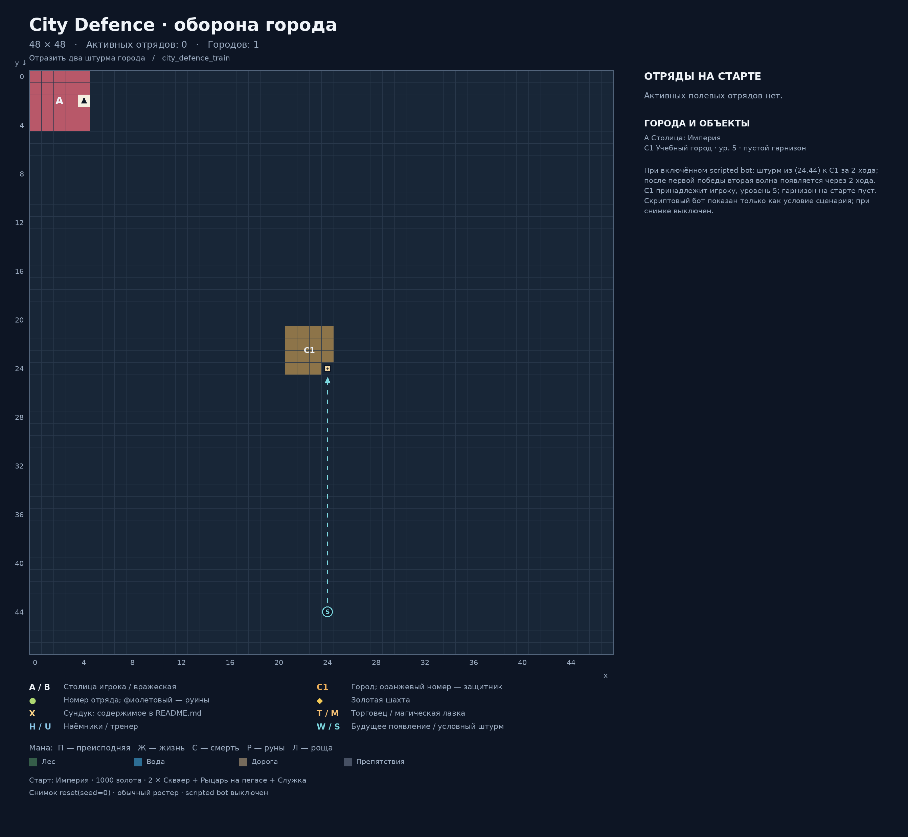
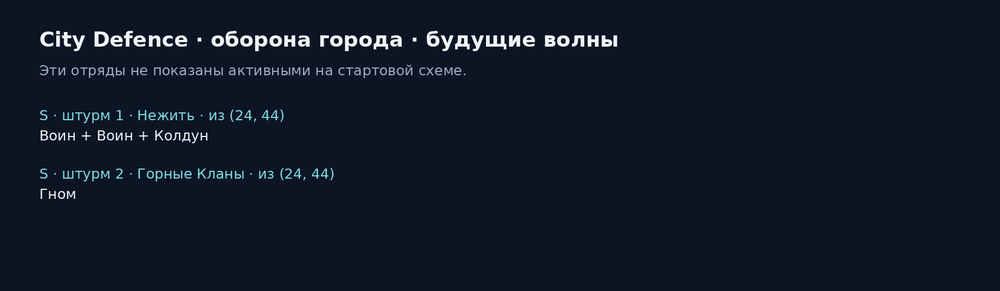

# City Defence · оборона города

Карта: `city_defence_train`. Игровая сетка: **48 × 48**.
Координаты `(x, y)`: x вправо, y вниз, отсчёт от нуля.
Снимок реальной среды после `reset(seed=0)`: `local5`, `use_boss_starting_roster=False`, scripted bot выключен. Закреплённый картой отряд сохраняется.
Это документация карты; генератор не запускает обучение, оценку или replay.

## Старт
- Фракция: Империя
- Герой: (4, 2)
- Золото: 1000
- Отряд: 2 × Скваер + Рыцарь на пегасе + Служка
- Цель: Отразить два штурма города

## Обозначения
- A / B: столица игрока / вражеская столица; треугольник — старт героя.
- C: город. T: торговец. M: магическая лавка. H: наёмники. U: тренер.
- Точки возле магазина показывают все действующие клетки взаимодействия.
- X: сундук; ромб: шахта. П/Ж/С/Р/Л: преисподняя/жизнь/смерть/руны/роща.
- Круг: отряд. Зелёный: полевой; оранжевый: город; фиолетовый: руины; красный: столица.
- Для Mirrow match цвета — заданные уровни сложности; номер общий для зеркальной пары.
- W: место будущего появления; S: условный штурм. Знак + после номера: несколько армий на одной клетке.
- Большое существо занимает 2 клетки, но считается одним бойцом.

## Города и объекты
- A: Столица: Империя, (4, 2)
- C1: Учебный город, (24, 24), уровень 5, отряды нет — принадлежит игроку

## Отряды
| № на схеме | enemy_id | Координаты | Статус | Состав | Бойцов / клеток |
|---|---:|---|---|---|---:|

## Ресурсы и сундуки

## Примечания
- При включённом scripted bot: штурм из (24,44) к C1 за 2 хода; после первой победы вторая волна появляется через 2 хода.
- C1 принадлежит игроку, уровень 5; гарнизон на старте пуст.
- Скриптовый бот показан только как условие сценария; при снимке выключен.

## Обновление
Из папки `Big_map`: `python tools/generate_map_layouts.py --map city_defence_train`.
Точные данные снимка и все координаты сохранены в `layout.json`.
В этой папке намеренно нет `__init__.py`: игровые импорты продолжают использовать соседний `city_defence_train.py`.
