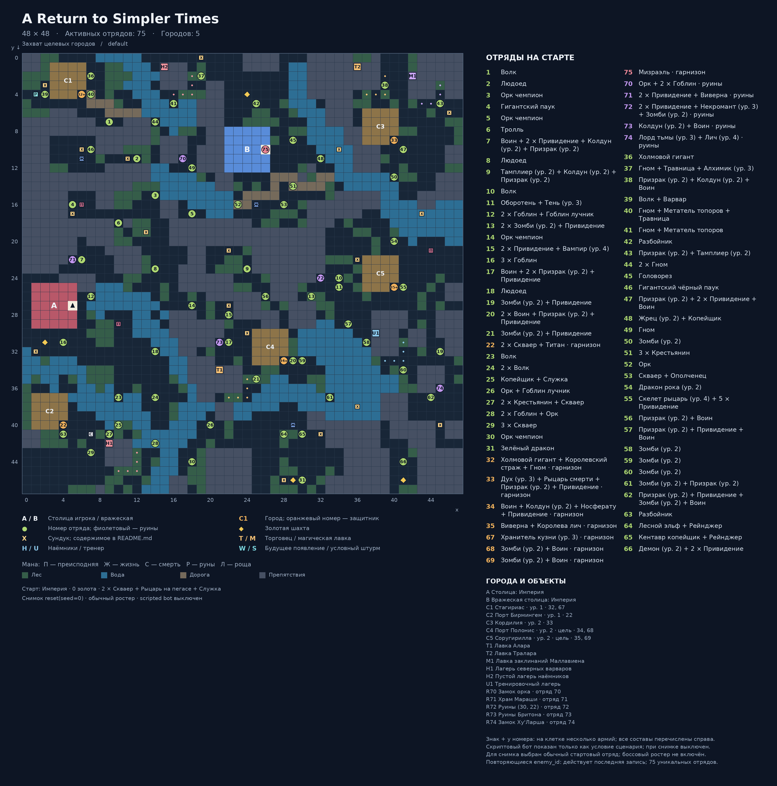

# A Return to Simpler Times

Карта: `default`. Игровая сетка: **48 × 48**.
Координаты `(x, y)`: x вправо, y вниз, отсчёт от нуля.
Снимок реальной среды после `reset(seed=0)`: `local5`, `use_boss_starting_roster=False`, scripted bot выключен. Закреплённый картой отряд сохраняется.
Это документация карты; генератор не запускает обучение, оценку или replay.

## Старт
- Фракция: Империя
- Герой: (5, 27)
- Золото: 0
- Отряд: 2 × Скваер + Рыцарь на пегасе + Служка
- Цель: Захват целевых городов

## Обозначения
- A / B: столица игрока / вражеская столица; треугольник — старт героя.
- C: город. T: торговец. M: магическая лавка. H: наёмники. U: тренер.
- Точки возле магазина показывают все действующие клетки взаимодействия.
- X: сундук; ромб: шахта. П/Ж/С/Р/Л: преисподняя/жизнь/смерть/руны/роща.
- Круг: отряд. Зелёный: полевой; оранжевый: город; фиолетовый: руины; красный: столица.
- Для Mirrow match цвета — заданные уровни сложности; номер общий для зеркальной пары.
- W: место будущего появления; S: условный штурм. Знак + после номера: несколько армий на одной клетке.
- Большое существо занимает 2 клетки, но считается одним бойцом.

## Города и объекты
- A: Столица: Империя, (5, 27)
- B: Вражеская столица: Империя, (26, 10)
- C1: Стагириас, (6, 4), уровень 1, отряды [32, 67]
- C2: Порт Бирмингем, (4, 40), уровень 1, отряды [22]
- C3: Кордилия, (40, 9), уровень 2, отряды [33]
- C4: Порт Полонис, (28, 33), уровень 2, отряды [34, 68] — цель кампании
- C5: Соругирилла, (40, 25), уровень 2, отряды [35, 69] — цель кампании
- T1: Лавка Алара, якорь (21, 34); взаимодействие: (24, 35), (24, 36), (22, 37), (23, 37), (24, 37)
- T2: Лавка Тралара, якорь (36, 1); взаимодействие: (39, 2), (39, 3), (37, 4), (38, 4), (39, 4)
- M1: Лавка заклинаний Маллавиена, якорь (42, 2); взаимодействие: (45, 3), (45, 4), (43, 5), (44, 5), (45, 5)
- H1: Лагерь северных варваров, якорь (9, 42); взаимодействие: (12, 43), (12, 44), (10, 45), (11, 45), (12, 45)
- H2: Пустой лагерь наёмников, якорь (15, 1); взаимодействие: (18, 2), (18, 3), (16, 4), (17, 4), (18, 4)
- U1: Тренировочный лагерь, якорь (38, 30); взаимодействие: (41, 31), (41, 32), (39, 33), (40, 33), (41, 33)

## Отряды
| № на схеме | enemy_id | Координаты | Статус | Состав | Бойцов / клеток |
|---|---:|---|---|---|---:|
| 1 | 1 | (9, 7) | Полевой | Волк | 1 / 1 |
| 2 | 2 | (12, 11) | Полевой | Людоед | 1 / 2 |
| 3 | 3 | (14, 15) | Полевой | Орк чемпион | 1 / 1 |
| 4 | 4 | (5, 16) | Полевой | Гигантский паук | 1 / 2 |
| 5 | 5 | (18, 17) | Полевой | Орк чемпион | 1 / 1 |
| 6 | 6 | (10, 18) | Полевой | Тролль | 1 / 2 |
| 7 | 7 | (6, 22) | Полевой | Воин + 2 × Привидение + Колдун (ур. 2) + Призрак (ур. 2) | 5 / 5 |
| 8 | 8 | (14, 23) | Полевой | Людоед | 1 / 2 |
| 9 | 9 | (24, 23) | Полевой | Тамплиер (ур. 2) + Колдун (ур. 2) + Призрак (ур. 2) | 3 / 3 |
| 10 | 10 | (34, 24) | Полевой | Волк | 1 / 1 |
| 11 | 11 | (34, 25) | Полевой | Оборотень + Тень (ур. 3) | 2 / 2 |
| 12 | 12 | (7, 26) | Полевой | 2 × Гоблин + Гоблин лучник | 3 / 3 |
| 13 | 13 | (31, 26) | Полевой | 2 × Зомби (ур. 2) + Привидение | 3 / 3 |
| 14 | 14 | (18, 27) | Полевой | Орк чемпион | 1 / 1 |
| 15 | 15 | (22, 28) | Полевой | 2 × Привидение + Вампир (ур. 4) | 3 / 3 |
| 16 | 16 | (4, 31) | Полевой | 3 × Гоблин | 3 / 3 |
| 17 | 17 | (22, 31) | Полевой | Воин + 2 × Призрак (ур. 2) + Привидение | 4 / 4 |
| 18 | 18 | (14, 32) | Полевой | Людоед | 1 / 2 |
| 19 | 19 | (45, 32) | Полевой | Зомби (ур. 2) + Привидение | 2 / 2 |
| 20 | 20 | (29, 33) | Полевой | 2 × Воин + Призрак (ур. 2) + Привидение | 4 / 4 |
| 21 | 21 | (25, 35) | Полевой | Зомби (ур. 2) + Привидение | 2 / 2 |
| 22 | 22 | (4, 40) | Город | 2 × Скваер + Титан | 3 / 4 |
| 23 | 23 | (10, 37) | Полевой | Волк | 1 / 1 |
| 24 | 24 | (14, 37) | Полевой | 2 × Волк | 2 / 2 |
| 25 | 25 | (10, 40) | Полевой | Копейщик + Служка | 2 / 2 |
| 26 | 26 | (20, 40) | Полевой | Орк + Гоблин лучник | 2 / 2 |
| 27 | 27 | (9, 41) | Полевой | 2 × Крестьянин + Скваер | 3 / 3 |
| 28 | 28 | (14, 42) | Полевой | 2 × Гоблин + Орк | 3 / 3 |
| 29 | 29 | (7, 43) | Полевой | 3 × Скваер | 3 / 3 |
| 30 | 30 | (18, 44) | Полевой | Орк чемпион | 1 / 1 |
| 31 | 31 | (30, 46) | Полевой | Зелёный дракон | 1 / 2 |
| 32 | 32 | (6, 4) | Город | Холмовой гигант + Королевский страж + Гном | 3 / 4 |
| 33 | 33 | (40, 9) | Город | Дух (ур. 3) + Рыцарь смерти + Призрак (ур. 2) + Привидение | 4 / 4 |
| 34 | 34 | (28, 33) | Город | Воин + Колдун (ур. 2) + Носферату + Привидение | 4 / 4 |
| 35 | 35 | (40, 25) | Город | Виверна + Королева лич | 2 / 3 |
| 67 | 67 | (6, 4) | Город | Хранитель кузни (ур. 3) | 1 / 1 |
| 68 | 68 | (28, 33) | Город | Зомби (ур. 2) + Воин | 2 / 2 |
| 69 | 69 | (40, 25) | Город | Зомби (ур. 2) + Воин | 2 / 2 |
| 75 | 75 | (26, 10) | Столица | Мизраэль | 1 / 1 |
| 70 | 70 | (17, 11) | Руины | Орк + 2 × Гоблин | 3 / 3 |
| 71 | 71 | (5, 22) | Руины | 2 × Привидение + Виверна | 3 / 4 |
| 72 | 72 | (32, 24) | Руины | 2 × Привидение + Некромант (ур. 3) + Зомби (ур. 2) | 4 / 4 |
| 73 | 73 | (21, 31) | Руины | Колдун (ур. 2) + Воин | 2 / 2 |
| 74 | 74 | (45, 36) | Руины | Лорд тьмы (ур. 3) + Лич (ур. 4) | 2 / 2 |
| 36 | 36 | (7, 2) | Полевой | Холмовой гигант | 1 / 2 |
| 37 | 37 | (19, 2) | Полевой | Гном + Травница + Алхимик (ур. 3) | 3 / 3 |
| 38 | 38 | (39, 3) | Полевой | Призрак (ур. 2) + Колдун (ур. 2) + Воин | 3 / 3 |
| 39 | 39 | (2, 4) | Полевой | Волк + Варвар | 2 / 2 |
| 40 | 40 | (7, 4) | Полевой | Гном + Метатель топоров + Травница | 3 / 3 |
| 41 | 41 | (16, 5) | Полевой | Гном + Метатель топоров | 2 / 2 |
| 42 | 42 | (25, 5) | Полевой | Разбойник | 1 / 1 |
| 43 | 43 | (45, 5) | Полевой | Призрак (ур. 2) + Тамплиер (ур. 2) | 2 / 2 |
| 44 | 44 | (14, 7) | Полевой | 2 × Гном | 2 / 2 |
| 45 | 45 | (29, 9) | Полевой | Головорез | 1 / 1 |
| 46 | 46 | (7, 10) | Полевой | Гигантский чёрный паук | 1 / 2 |
| 47 | 47 | (41, 10) | Полевой | Призрак (ур. 2) + 2 × Привидение + Воин | 4 / 4 |
| 48 | 48 | (32, 11) | Полевой | Жрец (ур. 2) + Копейщик | 2 / 2 |
| 49 | 49 | (18, 12) | Полевой | Гном | 1 / 1 |
| 50 | 50 | (40, 13) | Полевой | Зомби (ур. 2) | 1 / 1 |
| 51 | 51 | (29, 14) | Полевой | 3 × Крестьянин | 3 / 3 |
| 52 | 52 | (23, 16) | Полевой | Орк | 1 / 1 |
| 53 | 53 | (28, 16) | Полевой | Скваер + Ополченец | 2 / 2 |
| 54 | 54 | (40, 20) | Полевой | Дракон рока (ур. 2) | 1 / 2 |
| 55 | 55 | (41, 25) | Полевой | Скелет рыцарь (ур. 4) + 5 × Привидение | 6 / 6 |
| 56 | 56 | (26, 26) | Полевой | Призрак (ур. 2) + Воин | 2 / 2 |
| 57 | 57 | (35, 29) | Полевой | Призрак (ур. 2) + Привидение + Воин | 3 / 3 |
| 58 | 58 | (37, 31) | Полевой | Зомби (ур. 2) | 1 / 1 |
| 59 | 59 | (30, 33) | Полевой | Зомби (ур. 2) | 1 / 1 |
| 60 | 60 | (41, 34) | Полевой | Зомби (ур. 2) | 1 / 1 |
| 61 | 61 | (33, 37) | Полевой | Зомби (ур. 2) + Призрак (ур. 2) | 2 / 2 |
| 62 | 62 | (44, 37) | Полевой | Призрак (ур. 2) + Привидение + Зомби (ур. 2) + Воин | 4 / 4 |
| 63 | 63 | (4, 41) | Полевой | Разбойник | 1 / 1 |
| 64 | 64 | (28, 41) | Полевой | Лесной эльф + Рейнджер | 2 / 2 |
| 65 | 65 | (30, 41) | Полевой | Кентавр копейщик + Рейнджер | 2 / 2 |
| 66 | 66 | (41, 44) | Полевой | Демон (ур. 2) + 2 × Привидение | 3 / 4 |

## Ресурсы и сундуки
- Шахта 1: (2, 31)
- Шахта 2: (24, 4)
- Шахта 3: (29, 46)
- Шахта 4: (41, 46)
- Мана преисподней: (6, 16)
- Мана преисподней: (44, 21)
- Мана преисподней: (10, 29)
- Мана жизни: (6, 11)
- Мана жизни: (25, 16)
- Мана жизни: (29, 40)
- Мана смерти: (7, 41)
- Мана рун: (1, 4)
- X1: (28, 46) — Banner of War
- X2: (36, 38) — Potion of Healing, Life Potion
- X3: (19, 0) — Potion of Healing, Life Potion
- X4: (43, 17) — Potion of Strength
- X5: (22, 21) — Potion of Invulnerability
- X6: (6, 10) — Banner of Might
- X7: (5, 17) — Tome of Arcanum
- X8: (22, 27) — Vampire Orb
- X9: (46, 6) — Orb of Life
- X10: (45, 40) — Lich Orb
- X11: (36, 22) — Zombie Talisman
- X12: (11, 11) — Ruby (Valuable)
- X13: (13, 19) — Ruby (Valuable)
- X14: (32, 41) — Potion of Healing, Diamond (Valuable)
- X15: (1, 32) — Mind ward scroll
- X16: (2, 3) — Mind ward scroll
- X17: (34, 10) — Potion of Healing, Bronze Ring (Valuable)
- X18: (24, 30) — Potion of Healing, Bronze Ring (Valuable)
- Руины 70 «Замок орка»: 200 золота; Эликсир Силы титана
- Руины 71 «Храм Мараши»: 300 золота; Эликсир неуязвимости
- Руины 72 «Руины (30, 22)»: 300 золота; Эликсир Жизни
- Руины 73 «Руины Бритона»: 150 золота; Эликсир Всевышнего
- Руины 74 «Замок Ху'Ларша»: 400 золота; Кольцо веков (Артефакт)

## Примечания
- Знак + у номера: на клетке несколько армий; все составы перечислены справа.
- Скриптовый бот показан только как условие сценария; при снимке выключен.
- Для снимка выбран обычный стартовый отряд; боссовый ростер не включён.
- Повторяющиеся enemy_id: действует последняя запись; 75 уникальных отрядов.

## Обновление
Из папки `Big_map`: `python tools/generate_map_layouts.py --map default`.
Точные данные снимка и все координаты сохранены в `layout.json`.
В этой папке намеренно нет `__init__.py`: игровые импорты продолжают использовать соседний `default.py`.
