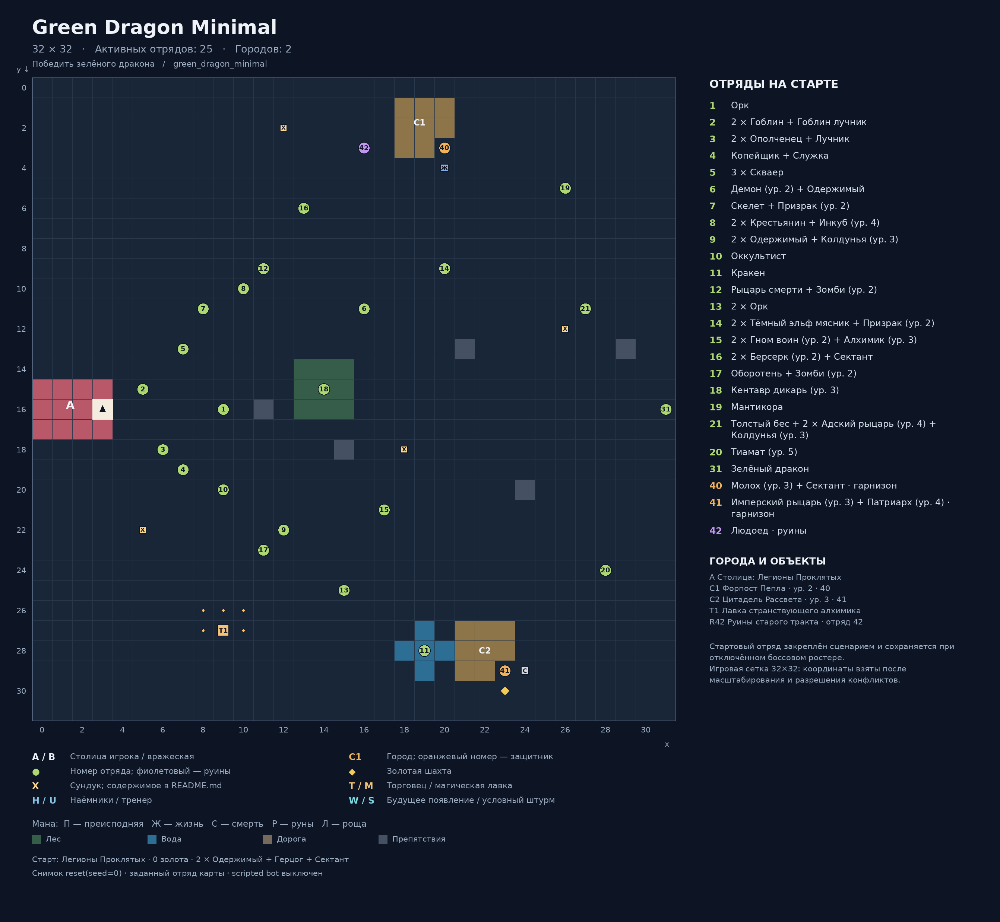

# Green Dragon Minimal

Карта: `green_dragon_minimal`. Игровая сетка: **32 × 32**.
Координаты `(x, y)`: x вправо, y вниз, отсчёт от нуля.
Снимок реальной среды после `reset(seed=0)`: `local5`, `use_boss_starting_roster=False`, scripted bot выключен. Закреплённый картой отряд сохраняется.
Это документация карты; генератор не запускает обучение, оценку или replay.

## Старт
- Фракция: Легионы Проклятых
- Герой: (3, 16)
- Золото: 0
- Отряд: 2 × Одержимый + Герцог + Сектант
- Цель: Победить зелёного дракона

## Обозначения
- A / B: столица игрока / вражеская столица; треугольник — старт героя.
- C: город. T: торговец. M: магическая лавка. H: наёмники. U: тренер.
- Точки возле магазина показывают все действующие клетки взаимодействия.
- X: сундук; ромб: шахта. П/Ж/С/Р/Л: преисподняя/жизнь/смерть/руны/роща.
- Круг: отряд. Зелёный: полевой; оранжевый: город; фиолетовый: руины; красный: столица.
- Для Mirrow match цвета — заданные уровни сложности; номер общий для зеркальной пары.
- W: место будущего появления; S: условный штурм. Знак + после номера: несколько армий на одной клетке.
- Большое существо занимает 2 клетки, но считается одним бойцом.

## Города и объекты
- A: Столица: Легионы Проклятых, (3, 16)
- C1: Форпост Пепла, (20, 3), уровень 2, отряды [40]
- C2: Цитадель Рассвета, (23, 29), уровень 3, отряды [41]
- T1: Лавка странствующего алхимика, якорь (9, 27); взаимодействие: (8, 26), (9, 26), (10, 26), (8, 27), (10, 27)

## Отряды
| № на схеме | enemy_id | Координаты | Статус | Состав | Бойцов / клеток |
|---|---:|---|---|---|---:|
| 1 | 1 | (9, 16) | Полевой | Орк | 1 / 1 |
| 2 | 2 | (5, 15) | Полевой | 2 × Гоблин + Гоблин лучник | 3 / 3 |
| 3 | 3 | (6, 18) | Полевой | 2 × Ополченец + Лучник | 3 / 3 |
| 4 | 4 | (7, 19) | Полевой | Копейщик + Служка | 2 / 2 |
| 5 | 5 | (7, 13) | Полевой | 3 × Скваер | 3 / 3 |
| 6 | 6 | (16, 11) | Полевой | Демон (ур. 2) + Одержимый | 2 / 3 |
| 7 | 7 | (8, 11) | Полевой | Скелет + Призрак (ур. 2) | 2 / 2 |
| 8 | 8 | (10, 10) | Полевой | 2 × Крестьянин + Инкуб (ур. 4) | 3 / 3 |
| 9 | 9 | (12, 22) | Полевой | 2 × Одержимый + Колдунья (ур. 3) | 3 / 3 |
| 10 | 10 | (9, 20) | Полевой | Оккультист | 1 / 1 |
| 11 | 11 | (19, 28) | Полевой | Кракен | 1 / 2 |
| 12 | 12 | (11, 9) | Полевой | Рыцарь смерти + Зомби (ур. 2) | 2 / 2 |
| 13 | 13 | (15, 25) | Полевой | 2 × Орк | 2 / 2 |
| 14 | 14 | (20, 9) | Полевой | 2 × Тёмный эльф мясник + Призрак (ур. 2) | 3 / 3 |
| 15 | 15 | (17, 21) | Полевой | 2 × Гном воин (ур. 2) + Алхимик (ур. 3) | 3 / 3 |
| 16 | 16 | (13, 6) | Полевой | 2 × Берсерк (ур. 2) + Сектант | 3 / 3 |
| 17 | 17 | (11, 23) | Полевой | Оборотень + Зомби (ур. 2) | 2 / 2 |
| 18 | 18 | (14, 15) | Полевой | Кентавр дикарь (ур. 3) | 1 / 1 |
| 19 | 19 | (26, 5) | Полевой | Мантикора | 1 / 2 |
| 21 | 21 | (27, 11) | Полевой | Толстый бес + 2 × Адский рыцарь (ур. 4) + Колдунья (ур. 3) | 4 / 5 |
| 20 | 20 | (28, 24) | Полевой | Тиамат (ур. 5) | 1 / 2 |
| 31 | 31 | (31, 16) | Полевой | Зелёный дракон | 1 / 2 |
| 40 | 40 | (20, 3) | Город | Молох (ур. 3) + Сектант | 2 / 3 |
| 41 | 41 | (23, 29) | Город | Имперский рыцарь (ур. 3) + Патриарх (ур. 4) | 2 / 2 |
| 42 | 42 | (16, 3) | Руины | Людоед | 1 / 2 |

## Ресурсы и сундуки
- Шахта 1: (23, 30)
- Мана жизни: (20, 4)
- Мана смерти: (24, 29)
- X1: (5, 22) — Эликсир инициативы (+10%)
- X2: (12, 2) — Зелье точности (+30%)
- X3: (18, 18) — Runestone (Artifact)
- X4: (26, 12) — Angel Orb
- Руины 42 «Руины старого тракта»: 0 золота; Emerald (Valuable)

## Примечания
- Стартовый отряд закреплён сценарием и сохраняется при отключённом боссовом ростере.
- Игровая сетка 32×32: координаты взяты после масштабирования и разрешения конфликтов.

## Обновление
Из папки `Big_map`: `python tools/generate_map_layouts.py --map green_dragon_minimal`.
Точные данные снимка и все координаты сохранены в `layout.json`.
В этой папке намеренно нет `__init__.py`: игровые импорты продолжают использовать соседний `green_dragon_minimal.py`.
