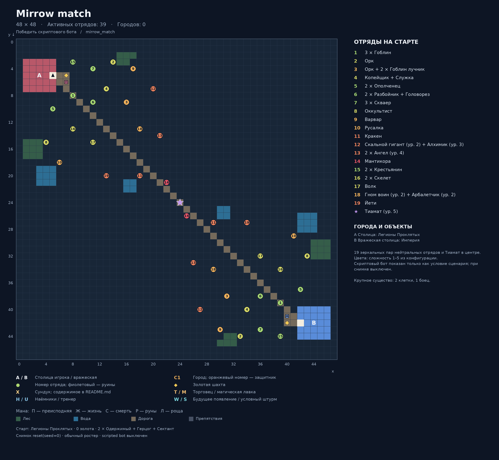

# Mirrow match

Карта: `mirrow_match`. Игровая сетка: **48 × 48**.
Координаты `(x, y)`: x вправо, y вниз, отсчёт от нуля.
Снимок реальной среды после `reset(seed=0)`: `local5`, `use_boss_starting_roster=False`, scripted bot выключен. Закреплённый картой отряд сохраняется.
Это документация карты; генератор не запускает обучение, оценку или replay.

## Старт
- Фракция: Легионы Проклятых
- Герой: (5, 5)
- Золото: 0
- Отряд: 2 × Одержимый + Герцог + Сектант
- Цель: Победить скриптового бота

## Обозначения
- A / B: столица игрока / вражеская столица; треугольник — старт героя.
- C: город. T: торговец. M: магическая лавка. H: наёмники. U: тренер.
- Точки возле магазина показывают все действующие клетки взаимодействия.
- X: сундук; ромб: шахта. П/Ж/С/Р/Л: преисподняя/жизнь/смерть/руны/роща.
- Круг: отряд. Зелёный: полевой; оранжевый: город; фиолетовый: руины; красный: столица.
- Для Mirrow match цвета — заданные уровни сложности; номер общий для зеркальной пары.
- W: место будущего появления; S: условный штурм. Знак + после номера: несколько армий на одной клетке.
- Большое существо занимает 2 клетки, но считается одним бойцом.

## Города и объекты
- A: Столица: Легионы Проклятых, (5, 5)
- B: Вражеская столица: Империя, (42, 42)

## Отряды
| № на схеме | enemy_id | Координаты | Статус | Состав | Бойцов / клеток |
|---|---:|---|---|---|---:|
| 1 | 101 | (8, 8) | Полевой | 3 × Гоблин | 3 / 3 |
| 2 | 102 | (14, 3) | Полевой | Орк | 1 / 1 |
| 3 | 103 | (16, 9) | Полевой | Орк + 2 × Гоблин лучник | 3 / 3 |
| 4 | 104 | (13, 7) | Полевой | Копейщик + Служка | 2 / 2 |
| 5 | 105 | (5, 10) | Полевой | 2 × Ополченец | 2 / 2 |
| 6 | 106 | (11, 9) | Полевой | 2 × Разбойник + Головорез | 3 / 3 |
| 7 | 107 | (11, 4) | Полевой | 3 × Скваер | 3 / 3 |
| 8 | 108 | (4, 15) | Полевой | Оккультист | 1 / 1 |
| 9 | 109 | (17, 4) | Полевой | Варвар | 1 / 1 |
| 10 | 110 | (6, 18) | Полевой | Русалка | 1 / 1 |
| 11 | 111 | (18, 20) | Полевой | Кракен | 1 / 2 |
| 12 | 112 | (20, 7) | Полевой | Скальной гигант (ур. 2) + Алхимик (ур. 3) | 2 / 3 |
| 13 | 113 | (21, 14) | Полевой | 2 × Ангел (ур. 4) | 2 / 2 |
| 14 | 114 | (22, 21) | Полевой | Мантикора | 1 / 2 |
| 15 | 115 | (8, 3) | Полевой | 2 × Крестьянин | 2 / 2 |
| 16 | 116 | (8, 13) | Полевой | 2 × Скелет | 2 / 2 |
| 17 | 117 | (11, 15) | Полевой | Волк | 1 / 1 |
| 18 | 118 | (18, 13) | Полевой | Гном воин (ур. 2) + Арбалетчик (ур. 2) | 2 / 2 |
| 19 | 119 | (13, 20) | Полевой | Йети | 1 / 2 |
| 1 | 201 | (39, 39) | Полевой | 3 × Гоблин | 3 / 3 |
| 2 | 202 | (33, 44) | Полевой | Орк | 1 / 1 |
| 3 | 203 | (31, 38) | Полевой | Орк + 2 × Гоблин лучник | 3 / 3 |
| 4 | 204 | (34, 40) | Полевой | Копейщик + Служка | 2 / 2 |
| 5 | 205 | (42, 37) | Полевой | 2 × Ополченец | 2 / 2 |
| 6 | 206 | (36, 38) | Полевой | 2 × Разбойник + Головорез | 3 / 3 |
| 7 | 207 | (36, 43) | Полевой | 3 × Скваер | 3 / 3 |
| 8 | 208 | (43, 32) | Полевой | Оккультист | 1 / 1 |
| 9 | 209 | (30, 43) | Полевой | Варвар | 1 / 1 |
| 10 | 210 | (41, 29) | Полевой | Русалка | 1 / 1 |
| 11 | 211 | (29, 27) | Полевой | Кракен | 1 / 2 |
| 12 | 212 | (27, 40) | Полевой | Скальной гигант (ур. 2) + Алхимик (ур. 3) | 2 / 3 |
| 13 | 213 | (26, 33) | Полевой | 2 × Ангел (ур. 4) | 2 / 2 |
| 14 | 214 | (25, 26) | Полевой | Мантикора | 1 / 2 |
| 15 | 215 | (39, 44) | Полевой | 2 × Крестьянин | 2 / 2 |
| 16 | 216 | (39, 34) | Полевой | 2 × Скелет | 2 / 2 |
| 17 | 217 | (36, 32) | Полевой | Волк | 1 / 1 |
| 18 | 218 | (29, 34) | Полевой | Гном воин (ур. 2) + Арбалетчик (ур. 2) | 2 / 2 |
| 19 | 219 | (34, 27) | Полевой | Йети | 1 / 2 |
| ★ | 250 | (24, 24) | Полевой | Тиамат (ур. 5) | 1 / 2 |

## Ресурсы и сундуки
- Шахта 1: (7, 5)
- Шахта 2: (40, 42)
- Мана преисподней: (7, 6)
- Мана жизни: (40, 41)

## Примечания
- 19 зеркальных пар нейтральных отрядов и Тиамат в центре. Цвета: сложность 1–5 из конфигурации.
- Скриптовый бот показан только как условие сценария; при снимке выключен.

## Обновление
Из папки `Big_map`: `python tools/generate_map_layouts.py --map mirrow_match`.
Точные данные снимка и все координаты сохранены в `layout.json`.
В этой папке намеренно нет `__init__.py`: игровые импорты продолжают использовать соседний `mirrow_match.py`.
