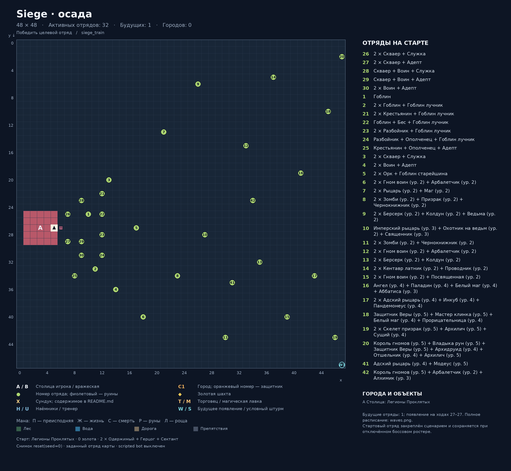
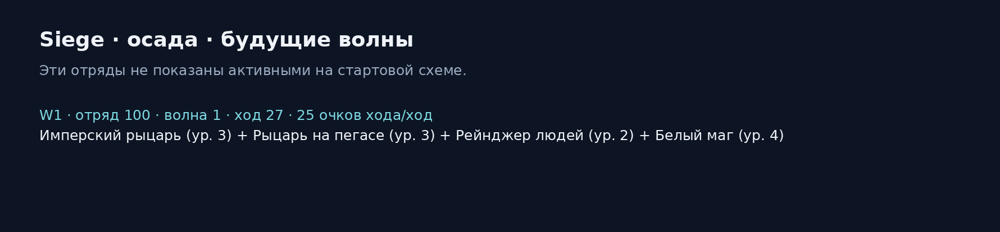

# Siege · осада

Карта: `siege_train`. Игровая сетка: **48 × 48**.
Координаты `(x, y)`: x вправо, y вниз, отсчёт от нуля.
Снимок реальной среды после `reset(seed=0)`: `local5`, `use_boss_starting_roster=False`, scripted bot выключен. Закреплённый картой отряд сохраняется.
Это документация карты; генератор не запускает обучение, оценку или replay.

## Старт
- Фракция: Легионы Проклятых
- Герой: (5, 27)
- Золото: 0
- Отряд: 2 × Одержимый + Герцог + Сектант
- Цель: Победить целевой отряд

## Обозначения
- A / B: столица игрока / вражеская столица; треугольник — старт героя.
- C: город. T: торговец. M: магическая лавка. H: наёмники. U: тренер.
- Точки возле магазина показывают все действующие клетки взаимодействия.
- X: сундук; ромб: шахта. П/Ж/С/Р/Л: преисподняя/жизнь/смерть/руны/роща.
- Круг: отряд. Зелёный: полевой; оранжевый: город; фиолетовый: руины; красный: столица.
- Для Mirrow match цвета — заданные уровни сложности; номер общий для зеркальной пары.
- W: место будущего появления; S: условный штурм. Знак + после номера: несколько армий на одной клетке.
- Большое существо занимает 2 клетки, но считается одним бойцом.

## Города и объекты
- A: Столица: Легионы Проклятых, (5, 27)

## Отряды
| № на схеме | enemy_id | Координаты | Статус | Состав | Бойцов / клеток |
|---|---:|---|---|---|---:|
| 26 | 26 | (7, 25) | Полевой | 2 × Скваер + Служка | 3 / 3 |
| 27 | 27 | (7, 29) | Полевой | 2 × Скваер + Адепт | 3 / 3 |
| 28 | 28 | (9, 23) | Полевой | Скваер + Воин + Служка | 3 / 3 |
| 29 | 29 | (9, 29) | Полевой | Скваер + Воин + Адепт | 3 / 3 |
| 30 | 30 | (9, 31) | Полевой | 2 × Воин + Адепт | 3 / 3 |
| 1 | 1 | (10, 25) | Полевой | Гоблин | 1 / 1 |
| 2 | 2 | (11, 33) | Полевой | 2 × Гоблин + Гоблин лучник | 3 / 3 |
| 21 | 21 | (12, 22) | Полевой | 2 × Крестьянин + Гоблин лучник | 3 / 3 |
| 22 | 22 | (12, 25) | Полевой | Гоблин + Бес + Гоблин лучник | 3 / 3 |
| 23 | 23 | (12, 28) | Полевой | 2 × Разбойник + Гоблин лучник | 3 / 3 |
| 24 | 24 | (12, 31) | Полевой | Разбойник + Ополченец + Гоблин лучник | 3 / 3 |
| 25 | 25 | (8, 34) | Полевой | Крестьянин + Ополченец + Адепт | 3 / 3 |
| 3 | 3 | (13, 20) | Полевой | 2 × Скваер + Служка | 3 / 3 |
| 4 | 4 | (14, 36) | Полевой | 2 × Воин + Адепт | 3 / 3 |
| 5 | 5 | (17, 27) | Полевой | 2 × Орк + Гоблин старейшина | 3 / 3 |
| 6 | 6 | (18, 40) | Полевой | 2 × Гном воин (ур. 2) + Арбалетчик (ур. 2) | 3 / 3 |
| 7 | 7 | (21, 13) | Полевой | 2 × Рыцарь (ур. 2) + Маг (ур. 2) | 3 / 3 |
| 8 | 8 | (23, 34) | Полевой | 2 × Зомби (ур. 2) + Призрак (ур. 2) + Чернокнижник (ур. 2) | 4 / 4 |
| 9 | 9 | (26, 6) | Полевой | 2 × Берсерк (ур. 2) + Колдун (ур. 2) + Ведьма (ур. 2) | 4 / 4 |
| 10 | 10 | (27, 28) | Полевой | Имперский рыцарь (ур. 3) + Охотник на ведьм (ур. 2) + Священник (ур. 3) | 3 / 3 |
| 11 | 11 | (30, 43) | Полевой | 2 × Зомби (ур. 2) + Чернокнижник (ур. 2) | 3 / 3 |
| 12 | 12 | (33, 15) | Полевой | 2 × Гном воин (ур. 2) + Арбалетчик (ур. 2) | 3 / 3 |
| 13 | 13 | (35, 32) | Полевой | 2 × Берсерк (ур. 2) + Колдун (ур. 2) | 3 / 3 |
| 14 | 14 | (37, 5) | Полевой | 2 × Кентавр латник (ур. 2) + Проводник (ур. 2) | 3 / 3 |
| 15 | 15 | (39, 40) | Полевой | 2 × Гном воин (ур. 2) + Посвященная (ур. 2) | 3 / 3 |
| 16 | 16 | (41, 19) | Полевой | Ангел (ур. 4) + Паладин (ур. 4) + Белый маг (ур. 4) + Аббатиса (ур. 3) | 4 / 4 |
| 17 | 17 | (43, 34) | Полевой | 2 × Адский рыцарь (ур. 4) + Инкуб (ур. 4) + Пандемонеус (ур. 4) | 4 / 4 |
| 18 | 18 | (45, 10) | Полевой | Защитник Веры (ур. 5) + Мастер клинка (ур. 5) + Белый маг (ур. 4) + Прорицательница (ур. 4) | 4 / 4 |
| 19 | 19 | (46, 43) | Полевой | 2 × Скелет призрак (ур. 5) + Архилич (ур. 5) + Сущий (ур. 4) | 4 / 4 |
| 20 | 20 | (47, 2) | Полевой | Король гномов (ур. 5) + Владыка рун (ур. 5) + Защитник Веры (ур. 5) + Архидруид (ур. 4) + Отшельник (ур. 4) + Архилич (ур. 5) | 6 / 6 |
| 41 | 41 | (31, 35) | Полевой | Адский рыцарь (ур. 4) + Модеус (ур. 5) | 2 / 2 |
| 42 | 42 | (34, 23) | Полевой | Король гномов (ур. 5) + Арбалетчик (ур. 2) + Алхимик (ур. 3) | 3 / 3 |
| 100 | 100 | (47, 47) | Будущая волна, ход 27 | Имперский рыцарь (ур. 3) + Рыцарь на пегасе (ур. 3) + Рейнджер людей (ур. 2) + Белый маг (ур. 4) | 4 / 4 |

## Ресурсы и сундуки
- Мана преисподней: (6, 27)

## Примечания
- Стартовый отряд закреплён сценарием и сохраняется при отключённом боссовом ростере.

## Обновление
Из папки `Big_map`: `python tools/generate_map_layouts.py --map siege_train`.
Точные данные снимка и все координаты сохранены в `layout.json`.
В этой папке намеренно нет `__init__.py`: игровые импорты продолжают использовать соседний `siege_train.py`.
