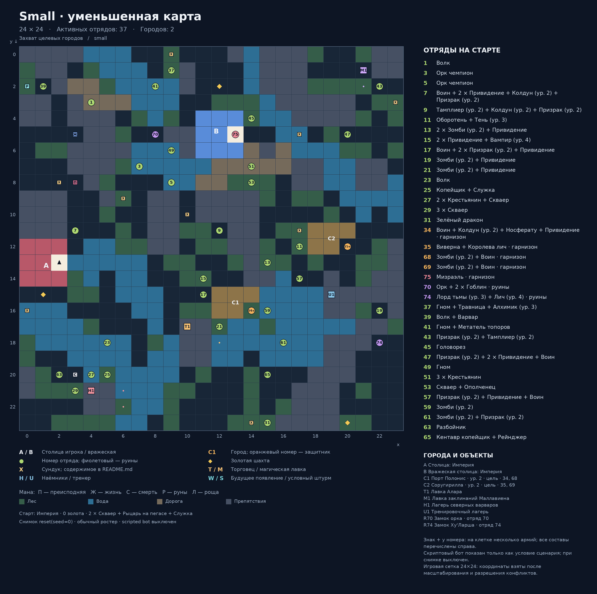

# Small · уменьшенная карта

Карта: `small`. Игровая сетка: **24 × 24**.
Координаты `(x, y)`: x вправо, y вниз, отсчёт от нуля.
Снимок реальной среды после `reset(seed=0)`: `local5`, `use_boss_starting_roster=False`, scripted bot выключен. Закреплённый картой отряд сохраняется.
Это документация карты; генератор не запускает обучение, оценку или replay.

## Старт
- Фракция: Империя
- Герой: (2, 13)
- Золото: 0
- Отряд: 2 × Скваер + Рыцарь на пегасе + Служка
- Цель: Захват целевых городов

## Обозначения
- A / B: столица игрока / вражеская столица; треугольник — старт героя.
- C: город. T: торговец. M: магическая лавка. H: наёмники. U: тренер.
- Точки возле магазина показывают все действующие клетки взаимодействия.
- X: сундук; ромб: шахта. П/Ж/С/Р/Л: преисподняя/жизнь/смерть/руны/роща.
- Круг: отряд. Зелёный: полевой; оранжевый: город; фиолетовый: руины; красный: столица.
- Для Mirrow match цвета — заданные уровни сложности; номер общий для зеркальной пары.
- W: место будущего появления; S: условный штурм. Знак + после номера: несколько армий на одной клетке.
- Большое существо занимает 2 клетки, но считается одним бойцом.

## Города и объекты
- A: Столица: Империя, (2, 13)
- B: Вражеская столица: Империя, (13, 5)
- C1: Порт Полонис, (14, 16), уровень 2, отряды [34, 68] — цель кампании
- C2: Соругирилла, (20, 12), уровень 2, отряды [35, 69] — цель кампании
- T1: Лавка Алара, якорь (10, 17); взаимодействие: (12, 17), (12, 18)
- M1: Лавка заклинаний Маллавиена, якорь (21, 1); взаимодействие: (22, 2), (21, 2)
- H1: Лагерь северных варваров, якорь (4, 21); взаимодействие: (6, 21), (6, 22)
- U1: Тренировочный лагерь, якорь (19, 15); взаимодействие: 

## Отряды
| № на схеме | enemy_id | Координаты | Статус | Состав | Бойцов / клеток |
|---|---:|---|---|---|---:|
| 1 | 1 | (4, 3) | Полевой | Волк | 1 / 1 |
| 3 | 3 | (7, 7) | Полевой | Орк чемпион | 1 / 1 |
| 5 | 5 | (9, 8) | Полевой | Орк чемпион | 1 / 1 |
| 7 | 7 | (3, 11) | Полевой | Воин + 2 × Привидение + Колдун (ур. 2) + Призрак (ур. 2) | 5 / 5 |
| 9 | 9 | (12, 11) | Полевой | Тамплиер (ур. 2) + Колдун (ур. 2) + Призрак (ур. 2) | 3 / 3 |
| 11 | 11 | (17, 12) | Полевой | Оборотень + Тень (ур. 3) | 2 / 2 |
| 13 | 13 | (15, 13) | Полевой | 2 × Зомби (ур. 2) + Привидение | 3 / 3 |
| 15 | 15 | (11, 14) | Полевой | 2 × Привидение + Вампир (ур. 4) | 3 / 3 |
| 17 | 17 | (11, 15) | Полевой | Воин + 2 × Призрак (ур. 2) + Привидение | 4 / 4 |
| 19 | 19 | (22, 16) | Полевой | Зомби (ур. 2) + Привидение | 2 / 2 |
| 21 | 21 | (12, 17) | Полевой | Зомби (ур. 2) + Привидение | 2 / 2 |
| 23 | 23 | (5, 18) | Полевой | Волк | 1 / 1 |
| 25 | 25 | (5, 20) | Полевой | Копейщик + Служка | 2 / 2 |
| 27 | 27 | (4, 20) | Полевой | 2 × Крестьянин + Скваер | 3 / 3 |
| 29 | 29 | (3, 21) | Полевой | 3 × Скваер | 3 / 3 |
| 31 | 31 | (15, 23) | Полевой | Зелёный дракон | 1 / 2 |
| 34 | 34 | (14, 16) | Город | Воин + Колдун (ур. 2) + Носферату + Привидение | 4 / 4 |
| 35 | 35 | (20, 12) | Город | Виверна + Королева лич | 2 / 3 |
| 68 | 68 | (14, 16) | Город | Зомби (ур. 2) + Воин | 2 / 2 |
| 69 | 69 | (20, 12) | Город | Зомби (ур. 2) + Воин | 2 / 2 |
| 75 | 75 | (13, 5) | Столица | Мизраэль | 1 / 1 |
| 70 | 70 | (8, 5) | Руины | Орк + 2 × Гоблин | 3 / 3 |
| 74 | 74 | (22, 18) | Руины | Лорд тьмы (ур. 3) + Лич (ур. 4) | 2 / 2 |
| 37 | 37 | (9, 1) | Полевой | Гном + Травница + Алхимик (ур. 3) | 3 / 3 |
| 39 | 39 | (1, 2) | Полевой | Волк + Варвар | 2 / 2 |
| 41 | 41 | (8, 2) | Полевой | Гном + Метатель топоров | 2 / 2 |
| 43 | 43 | (22, 2) | Полевой | Призрак (ур. 2) + Тамплиер (ур. 2) | 2 / 2 |
| 45 | 45 | (14, 4) | Полевой | Головорез | 1 / 1 |
| 47 | 47 | (20, 5) | Полевой | Призрак (ур. 2) + 2 × Привидение + Воин | 4 / 4 |
| 49 | 49 | (9, 6) | Полевой | Гном | 1 / 1 |
| 51 | 51 | (14, 7) | Полевой | 3 × Крестьянин | 3 / 3 |
| 53 | 53 | (14, 8) | Полевой | Скваер + Ополченец | 2 / 2 |
| 57 | 57 | (17, 14) | Полевой | Призрак (ур. 2) + Привидение + Воин | 3 / 3 |
| 59 | 59 | (15, 16) | Полевой | Зомби (ур. 2) | 1 / 1 |
| 61 | 61 | (16, 18) | Полевой | Зомби (ур. 2) + Призрак (ур. 2) | 2 / 2 |
| 63 | 63 | (2, 20) | Полевой | Разбойник | 1 / 1 |
| 65 | 65 | (15, 20) | Полевой | Кентавр копейщик + Рейнджер | 2 / 2 |

## Ресурсы и сундуки
- Шахта 1: (1, 15)
- Шахта 2: (12, 2)
- Шахта 3: (14, 23)
- Шахта 4: (20, 23)
- Мана преисподней: (3, 8)
- Мана жизни: (3, 5)
- Мана смерти: (3, 20)
- Мана рун: (0, 2)
- X1: (14, 23) — Banner of War
- X2: (9, 0) — Potion of Healing, Life Potion
- X3: (10, 10) — Potion of Invulnerability
- X4: (2, 8) — Tome of Arcanum
- X5: (23, 3) — Orb of Life
- X6: (17, 11) — Zombie Talisman
- X7: (6, 9) — Ruby (Valuable)
- X8: (0, 16) — Mind ward scroll
- X9: (17, 5) — Potion of Healing, Bronze Ring (Valuable)
- Руины 70 «Замок орка»: 200 золота; Эликсир Силы титана
- Руины 74 «Замок Ху'Ларша»: 400 золота; Кольцо веков (Артефакт)

## Примечания
- Знак + у номера: на клетке несколько армий; все составы перечислены справа.
- Скриптовый бот показан только как условие сценария; при снимке выключен.
- Игровая сетка 24×24: координаты взяты после масштабирования и разрешения конфликтов.

## Обновление
Из папки `Big_map`: `python tools/generate_map_layouts.py --map small`.
Точные данные снимка и все координаты сохранены в `layout.json`.
В этой папке намеренно нет `__init__.py`: игровые импорты продолжают использовать соседний `small.py`.
