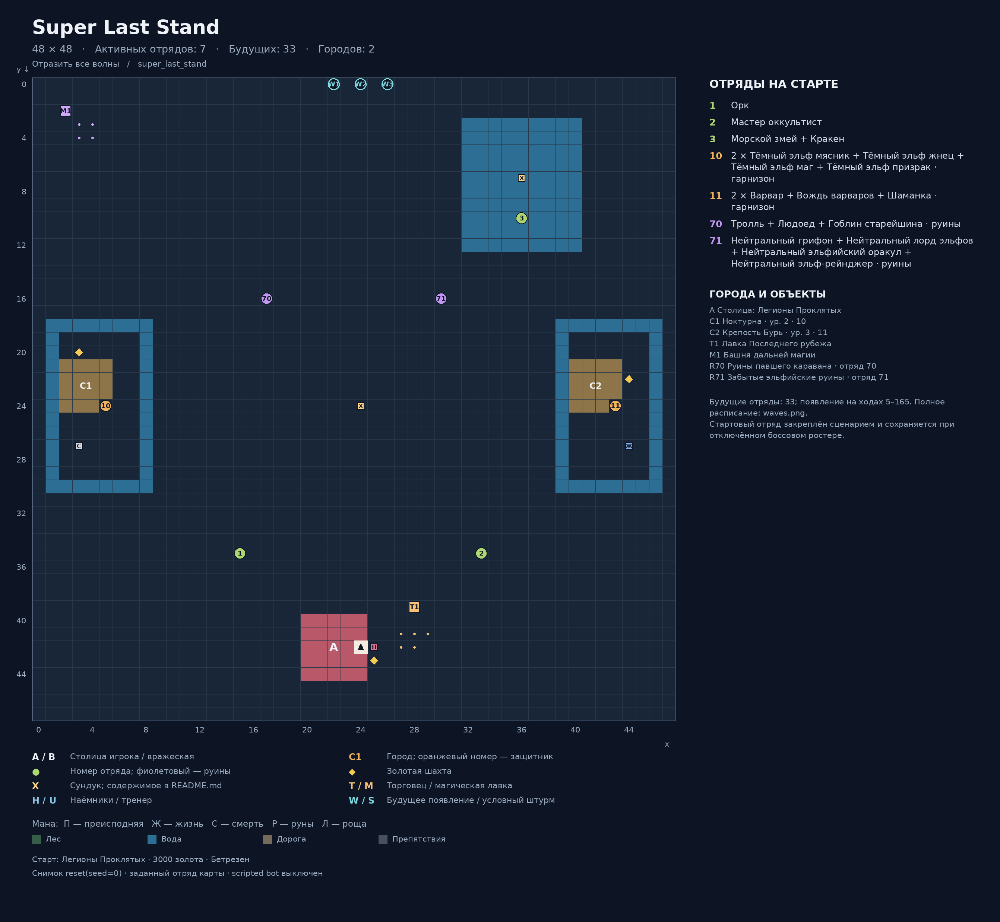
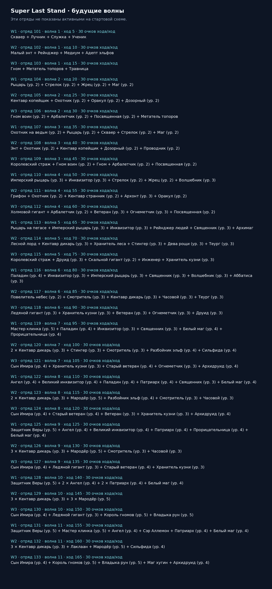

# Super Last Stand

Карта: `super_last_stand`. Игровая сетка: **48 × 48**.
Координаты `(x, y)`: x вправо, y вниз, отсчёт от нуля.
Снимок реальной среды после `reset(seed=0)`: `local5`, `use_boss_starting_roster=False`, scripted bot выключен. Закреплённый картой отряд сохраняется.
Это документация карты; генератор не запускает обучение, оценку или replay.

## Старт
- Фракция: Легионы Проклятых
- Герой: (24, 42)
- Золото: 3000
- Отряд: Бетрезен
- Цель: Отразить все волны

## Обозначения
- A / B: столица игрока / вражеская столица; треугольник — старт героя.
- C: город. T: торговец. M: магическая лавка. H: наёмники. U: тренер.
- Точки возле магазина показывают все действующие клетки взаимодействия.
- X: сундук; ромб: шахта. П/Ж/С/Р/Л: преисподняя/жизнь/смерть/руны/роща.
- Круг: отряд. Зелёный: полевой; оранжевый: город; фиолетовый: руины; красный: столица.
- Для Mirrow match цвета — заданные уровни сложности; номер общий для зеркальной пары.
- W: место будущего появления; S: условный штурм. Знак + после номера: несколько армий на одной клетке.
- Большое существо занимает 2 клетки, но считается одним бойцом.

## Города и объекты
- A: Столица: Легионы Проклятых, (24, 42)
- C1: Ноктурна, (5, 24), уровень 2, отряды [10]
- C2: Крепость Бурь, (43, 24), уровень 3, отряды [11]
- T1: Лавка Последнего рубежа, якорь (28, 39); взаимодействие: (27, 41), (28, 41), (29, 41), (27, 42), (28, 42)
- M1: Башня дальней магии, якорь (2, 2); взаимодействие: (3, 3), (4, 3), (3, 4), (4, 4)

## Отряды
| № на схеме | enemy_id | Координаты | Статус | Состав | Бойцов / клеток |
|---|---:|---|---|---|---:|
| 1 | 1 | (15, 35) | Полевой | Орк | 1 / 1 |
| 2 | 2 | (33, 35) | Полевой | Мастер оккультист | 1 / 1 |
| 3 | 3 | (36, 10) | Полевой | Морской змей + Кракен | 2 / 4 |
| 10 | 10 | (5, 24) | Город | 2 × Тёмный эльф мясник + Тёмный эльф жнец + Тёмный эльф маг + Тёмный эльф призрак | 5 / 5 |
| 11 | 11 | (43, 24) | Город | 2 × Варвар + Вождь варваров + Шаманка | 4 / 4 |
| 70 | 70 | (17, 16) | Руины | Тролль + Людоед + Гоблин старейшина | 3 / 5 |
| 71 | 71 | (30, 16) | Руины | Нейтральный грифон + Нейтральный лорд эльфов + Нейтральный эльфийский оракул + Нейтральный эльф-рейнджер | 4 / 5 |
| 101 | 101 | (22, 0) | Будущая волна, ход 5 | Скваер + Лучник + Служка + Ученик | 4 / 4 |
| 102 | 102 | (24, 0) | Будущая волна, ход 10 | Малый энт + Рейнджер + Медиум + Адепт эльфов | 4 / 4 |
| 103 | 103 | (26, 0) | Будущая волна, ход 15 | Гном + Метатель топоров + Травница | 3 / 3 |
| 104 | 104 | (22, 0) | Будущая волна, ход 20 | Рыцарь (ур. 2) + Стрелок (ур. 2) + Жрец (ур. 2) + Маг (ур. 2) | 4 / 4 |
| 105 | 105 | (24, 0) | Будущая волна, ход 25 | Кентавр копейщик + Охотник (ур. 2) + Оракул (ур. 2) + Дозорный (ур. 2) | 4 / 4 |
| 106 | 106 | (26, 0) | Будущая волна, ход 30 | Гном воин (ур. 2) + Арбалетчик (ур. 2) + Посвященная (ур. 2) + Метатель топоров | 4 / 4 |
| 107 | 107 | (22, 0) | Будущая волна, ход 35 | Охотник на ведьм (ур. 2) + Рыцарь (ур. 2) + Скваер + Стрелок (ур. 2) + Маг (ур. 2) | 5 / 5 |
| 108 | 108 | (24, 0) | Будущая волна, ход 40 | Энт + Охотник (ур. 2) + Кентавр копейщик + Дозорный (ур. 2) + Проводник (ур. 2) | 5 / 6 |
| 109 | 109 | (26, 0) | Будущая волна, ход 45 | Королевский страж + Гном воин (ур. 2) + Гном + Арбалетчик (ур. 2) + Посвященная (ур. 2) | 5 / 5 |
| 110 | 110 | (22, 0) | Будущая волна, ход 50 | Имперский рыцарь (ур. 3) + Инквизитор (ур. 3) + Стрелок (ур. 2) + Жрец (ур. 2) + Волшебник (ур. 3) | 5 / 5 |
| 111 | 111 | (24, 0) | Будущая волна, ход 55 | Грифон + Охотник (ур. 2) + Кентавр странник (ур. 2) + Архонт (ур. 3) + Оракул (ур. 2) | 5 / 6 |
| 112 | 112 | (26, 0) | Будущая волна, ход 60 | Холмовой гигант + Арбалетчик (ур. 2) + Ветеран (ур. 3) + Огнеметчик (ур. 3) + Посвященная (ур. 2) | 5 / 6 |
| 113 | 113 | (22, 0) | Будущая волна, ход 65 | Рыцарь на пегасе + Имперский рыцарь (ур. 3) + Инквизитор (ур. 3) + Рейнджер людей + Священник (ур. 3) + Архимаг | 6 / 6 |
| 114 | 114 | (24, 0) | Будущая волна, ход 70 | Лесной лорд + Кентавр дикарь (ур. 3) + Хранитель леса + Стингер (ур. 3) + Дева рощи (ур. 3) + Теург (ур. 3) | 6 / 6 |
| 115 | 115 | (26, 0) | Будущая волна, ход 75 | Королевский страж + Друид (ур. 3) + Скальной гигант (ур. 2) + Инженер + Хранитель кузни (ур. 3) | 5 / 6 |
| 116 | 116 | (22, 0) | Будущая волна, ход 80 | Паладин (ур. 4) + Инквизитор (ур. 3) + Имперский рыцарь (ур. 3) + Священник (ур. 3) + Волшебник (ур. 3) + Аббатиса (ур. 3) | 6 / 6 |
| 117 | 117 | (24, 0) | Будущая волна, ход 85 | Повелитель небес (ур. 2) + Смотритель (ур. 3) + Кентавр дикарь (ур. 3) + Часовой (ур. 3) + Теург (ур. 3) | 5 / 6 |
| 118 | 118 | (26, 0) | Будущая волна, ход 90 | Ледяной гигант (ур. 3) + Хранитель кузни (ур. 3) + Ветеран (ур. 3) + Огнеметчик (ур. 3) + Друид (ур. 3) | 5 / 6 |
| 119 | 119 | (22, 0) | Будущая волна, ход 95 | Мастер клинка (ур. 5) + Паладин (ур. 4) + Инквизитор (ур. 3) + Священник (ур. 3) + Белый маг (ур. 4) + Прорицательница (ур. 4) | 6 / 6 |
| 120 | 120 | (24, 0) | Будущая волна, ход 100 | 2 × Кентавр дикарь (ур. 3) + Стингер (ур. 3) + Смотритель (ур. 3) + Разбойник эльф (ур. 4) + Сильфида (ур. 4) | 6 / 6 |
| 121 | 121 | (26, 0) | Будущая волна, ход 105 | Сын Имира (ур. 4) + Хранитель кузни (ур. 3) + Старый ветеран (ур. 4) + Огнеметчик (ур. 3) + Архидруид (ур. 4) | 5 / 6 |
| 122 | 122 | (22, 0) | Будущая волна, ход 110 | Ангел (ур. 4) + Великий инквизитор (ур. 4) + Паладин (ур. 4) + Патриарх (ур. 4) + Священник (ур. 3) + Белый маг (ур. 4) | 6 / 6 |
| 123 | 123 | (24, 0) | Будущая волна, ход 115 | 2 × Кентавр дикарь (ур. 3) + Мародёр (ур. 5) + Разбойник эльф (ур. 4) + Смотритель (ур. 3) + Часовой (ур. 3) | 6 / 6 |
| 124 | 124 | (26, 0) | Будущая волна, ход 120 | Сын Имира (ур. 4) + Старый ветеран (ур. 4) + Ветеран (ур. 3) + Хранитель кузни (ур. 3) + Архидруид (ур. 4) | 5 / 6 |
| 125 | 125 | (22, 0) | Будущая волна, ход 125 | Защитник Веры (ур. 5) + Ангел (ур. 4) + Великий инквизитор (ур. 4) + Патриарх (ур. 4) + Прорицательница (ур. 4) + Белый маг (ур. 4) | 6 / 6 |
| 126 | 126 | (24, 0) | Будущая волна, ход 130 | 3 × Кентавр дикарь (ур. 3) + Мародёр (ур. 5) + Смотритель (ур. 3) + Часовой (ур. 3) | 6 / 6 |
| 127 | 127 | (26, 0) | Будущая волна, ход 135 | Сын Имира (ур. 4) + Ледяной гигант (ур. 3) + Старый ветеран (ур. 4) + Хранитель кузни (ур. 3) | 4 / 6 |
| 128 | 128 | (22, 0) | Будущая волна, ход 140 | Защитник Веры (ур. 5) + 2 × Ангел (ур. 4) + 2 × Патриарх (ур. 4) + Белый маг (ур. 4) | 6 / 6 |
| 129 | 129 | (24, 0) | Будущая волна, ход 145 | 3 × Кентавр дикарь (ур. 3) + 3 × Мародёр (ур. 5) | 6 / 6 |
| 130 | 130 | (26, 0) | Будущая волна, ход 150 | Сын Имира (ур. 4) + Ледяной гигант (ур. 3) + Король гномов (ур. 5) + Владыка рун (ур. 5) | 4 / 6 |
| 131 | 131 | (22, 0) | Будущая волна, ход 155 | Защитник Веры (ур. 5) + Мастер клинка (ур. 5) + Ангел (ур. 4) + Сэр Аллемон + Патриарх (ур. 4) + Белый маг (ур. 4) | 6 / 6 |
| 132 | 132 | (24, 0) | Будущая волна, ход 160 | 3 × Кентавр дикарь (ур. 3) + Лаклаан + Мародёр (ур. 5) + Сильфида (ур. 4) | 6 / 6 |
| 133 | 133 | (26, 0) | Будущая волна, ход 165 | Сын Имира (ур. 4) + Король гномов (ур. 5) + Владыка рун (ур. 5) + Маг хугин + Архидруид (ур. 4) | 5 / 6 |

## Ресурсы и сундуки
- Шахта 1: (3, 20)
- Шахта 2: (25, 43)
- Шахта 3: (44, 22)
- Мана преисподней: (25, 42)
- Мана смерти: (3, 27)
- Мана жизни: (44, 27)
- X1: (24, 24) — Эликсир неуязвимости
- X2: (36, 7) — Imperial Crown (Valuable)
- Руины 70 «Руины павшего каравана»: 900 золота; Runestone (Artifact), Unholy Chalice (Artifact)
- Руины 71 «Забытые эльфийские руины»: 600 золота; Banner of War, Orb of Witches

## Примечания
- Стартовый отряд закреплён сценарием и сохраняется при отключённом боссовом ростере.

## Обновление
Из папки `Big_map`: `python tools/generate_map_layouts.py --map super_last_stand`.
Точные данные снимка и все координаты сохранены в `layout.json`.
В этой папке намеренно нет `__init__.py`: игровые импорты продолжают использовать соседний `super_last_stand.py`.
