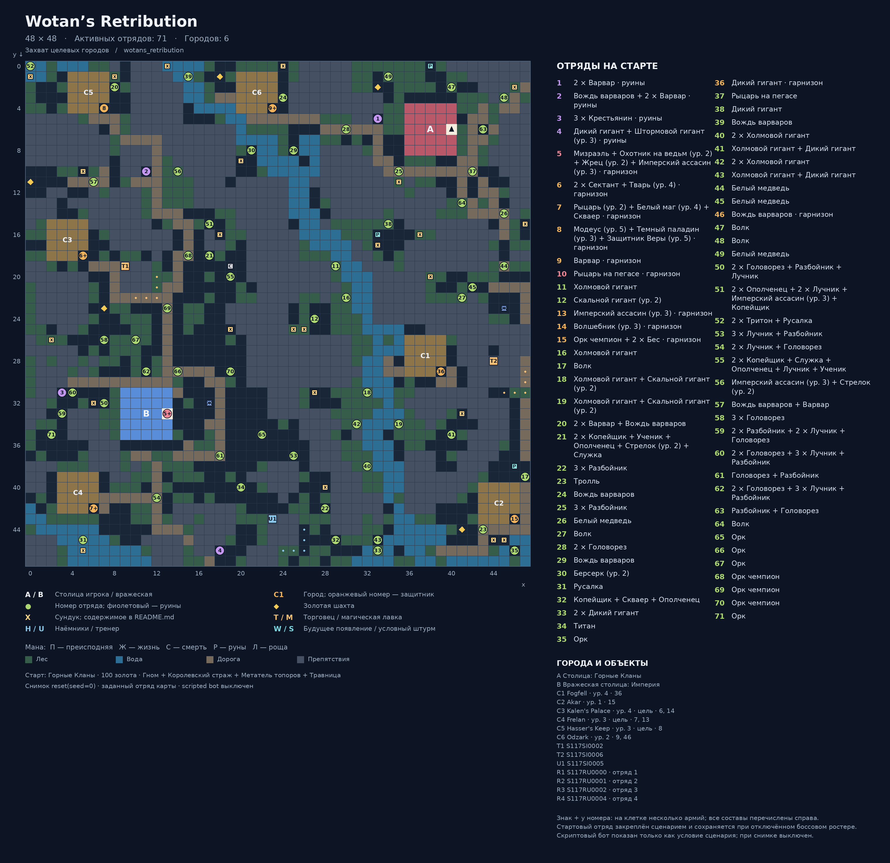

# Wotan’s Retribution

Карта: `wotans_retribution`. Игровая сетка: **48 × 48**.
Координаты `(x, y)`: x вправо, y вниз, отсчёт от нуля.
Снимок реальной среды после `reset(seed=0)`: `local5`, `use_boss_starting_roster=False`, scripted bot выключен. Закреплённый картой отряд сохраняется.
Это документация карты; генератор не запускает обучение, оценку или replay.

## Старт
- Фракция: Горные Кланы
- Герой: (40, 6)
- Золото: 100
- Отряд: Гном + Королевский страж + Метатель топоров + Травница
- Цель: Захват целевых городов

## Обозначения
- A / B: столица игрока / вражеская столица; треугольник — старт героя.
- C: город. T: торговец. M: магическая лавка. H: наёмники. U: тренер.
- Точки возле магазина показывают все действующие клетки взаимодействия.
- X: сундук; ромб: шахта. П/Ж/С/Р/Л: преисподняя/жизнь/смерть/руны/роща.
- Круг: отряд. Зелёный: полевой; оранжевый: город; фиолетовый: руины; красный: столица.
- Для Mirrow match цвета — заданные уровни сложности; номер общий для зеркальной пары.
- W: место будущего появления; S: условный штурм. Знак + после номера: несколько армий на одной клетке.
- Большое существо занимает 2 клетки, но считается одним бойцом.

## Города и объекты
- A: Столица: Горные Кланы, (40, 6)
- B: Вражеская столица: Империя, (13, 33)
- C1: Fogfell, (39, 29), уровень 4, отряды [36]
- C2: Akar, (46, 43), уровень 1, отряды [15]
- C3: Kalen's Palace, (5, 18), уровень 4, отряды [6, 14] — цель кампании
- C4: Frelan, (6, 42), уровень 3, отряды [7, 13] — цель кампании
- C5: Hasser's Keep, (7, 4), уровень 3, отряды [8] — цель кампании
- C6: Odzark, (23, 4), уровень 2, отряды [9, 46]
- T1: S117SI0002, якорь (9, 19); взаимодействие: (12, 20), (12, 21), (10, 22), (11, 22), (12, 22)
- T2: S117SI0006, якорь (44, 28); взаимодействие: (47, 29), (47, 30), (45, 31), (46, 31), (47, 31)
- U1: S117SI0005, якорь (23, 43); взаимодействие: (26, 44), (26, 45), (24, 46), (25, 46), (26, 46)

## Отряды
| № на схеме | enemy_id | Координаты | Статус | Состав | Бойцов / клеток |
|---|---:|---|---|---|---:|
| 1 | 1 | (33, 5) | Руины | 2 × Варвар | 2 / 2 |
| 2 | 2 | (11, 10) | Руины | Вождь варваров + 2 × Варвар | 3 / 3 |
| 3 | 3 | (3, 31) | Руины | 3 × Крестьянин | 3 / 3 |
| 4 | 4 | (18, 46) | Руины | Дикий гигант + Штормовой гигант (ур. 3) | 2 / 4 |
| 5 | 5 | (13, 33) | Столица | Мизраэль + Охотник на ведьм (ур. 2) + Жрец (ур. 2) + Имперский ассасин (ур. 3) | 4 / 4 |
| 6 | 6 | (5, 18) | Город | 2 × Сектант + Тварь (ур. 4) | 3 / 4 |
| 7 | 7 | (6, 42) | Город | Рыцарь (ур. 2) + Белый маг (ур. 4) + Скваер | 3 / 3 |
| 8 | 8 | (7, 4) | Город | Модеус (ур. 5) + Темный паладин (ур. 3) + Защитник Веры (ур. 5) | 3 / 3 |
| 9 | 9 | (23, 4) | Город | Варвар | 1 / 1 |
| 10 | 10 | (13, 33) | Столица | Рыцарь на пегасе | 1 / 1 |
| 11 | 11 | (29, 19) | Полевой | Холмовой гигант | 1 / 2 |
| 12 | 12 | (27, 24) | Полевой | Скальной гигант (ур. 2) | 1 / 2 |
| 13 | 13 | (6, 42) | Город | Имперский ассасин (ур. 3) | 1 / 1 |
| 14 | 14 | (5, 18) | Город | Волшебник (ур. 3) | 1 / 1 |
| 15 | 15 | (46, 43) | Город | Орк чемпион + 2 × Бес | 3 / 3 |
| 16 | 16 | (30, 22) | Полевой | Холмовой гигант | 1 / 2 |
| 17 | 17 | (47, 39) | Полевой | Волк | 1 / 1 |
| 18 | 18 | (32, 31) | Полевой | Холмовой гигант + Скальной гигант (ур. 2) | 2 / 4 |
| 19 | 19 | (35, 34) | Полевой | Холмовой гигант + Скальной гигант (ур. 2) | 2 / 4 |
| 20 | 20 | (8, 2) | Полевой | 2 × Варвар + Вождь варваров | 3 / 3 |
| 21 | 21 | (17, 18) | Полевой | 2 × Копейщик + Ученик + Ополченец + Стрелок (ур. 2) + Служка | 6 / 6 |
| 22 | 22 | (28, 42) | Полевой | 3 × Разбойник | 3 / 3 |
| 23 | 23 | (43, 44) | Полевой | Тролль | 1 / 2 |
| 24 | 24 | (24, 3) | Полевой | Вождь варваров | 1 / 1 |
| 25 | 25 | (35, 10) | Полевой | 3 × Разбойник | 3 / 3 |
| 26 | 26 | (45, 14) | Полевой | Белый медведь | 1 / 2 |
| 27 | 27 | (41, 22) | Полевой | Волк | 1 / 1 |
| 28 | 28 | (30, 6) | Полевой | 2 × Головорез | 2 / 2 |
| 29 | 29 | (25, 8) | Полевой | Вождь варваров | 1 / 1 |
| 30 | 30 | (21, 8) | Полевой | Берсерк (ур. 2) | 1 / 1 |
| 31 | 31 | (5, 45) | Полевой | Русалка | 1 / 1 |
| 32 | 32 | (29, 45) | Полевой | Копейщик + Скваер + Ополченец | 3 / 3 |
| 33 | 33 | (33, 46) | Полевой | 2 × Дикий гигант | 2 / 4 |
| 34 | 34 | (20, 40) | Полевой | Титан | 1 / 2 |
| 35 | 35 | (46, 46) | Полевой | Орк | 1 / 1 |
| 36 | 36 | (39, 29) | Город | Дикий гигант | 1 / 2 |
| 37 | 37 | (42, 10) | Полевой | Рыцарь на пегасе | 1 / 1 |
| 38 | 38 | (34, 15) | Полевой | Дикий гигант | 1 / 2 |
| 39 | 39 | (15, 1) | Полевой | Вождь варваров | 1 / 1 |
| 40 | 40 | (32, 38) | Полевой | 2 × Холмовой гигант | 2 / 4 |
| 41 | 41 | (40, 35) | Полевой | Холмовой гигант + Дикий гигант | 2 / 4 |
| 42 | 42 | (31, 34) | Полевой | 2 × Холмовой гигант | 2 / 4 |
| 43 | 43 | (33, 45) | Полевой | Холмовой гигант + Дикий гигант | 2 / 4 |
| 44 | 44 | (45, 19) | Полевой | Белый медведь | 1 / 2 |
| 45 | 45 | (42, 21) | Полевой | Белый медведь | 1 / 2 |
| 46 | 46 | (23, 4) | Город | Вождь варваров | 1 / 1 |
| 47 | 47 | (40, 2) | Полевой | Волк | 1 / 1 |
| 48 | 48 | (45, 3) | Полевой | Волк | 1 / 1 |
| 49 | 49 | (34, 1) | Полевой | Белый медведь | 1 / 2 |
| 50 | 50 | (7, 32) | Полевой | 2 × Головорез + Разбойник + Лучник | 4 / 4 |
| 51 | 51 | (17, 15) | Полевой | 2 × Ополченец + 2 × Лучник + Имперский ассасин (ур. 3) + Копейщик | 6 / 6 |
| 52 | 52 | (0, 0) | Полевой | 2 × Тритон + Русалка | 3 / 3 |
| 53 | 53 | (25, 37) | Полевой | 3 × Лучник + Разбойник | 4 / 4 |
| 54 | 54 | (12, 41) | Полевой | 2 × Лучник + Головорез | 3 / 3 |
| 55 | 55 | (19, 20) | Полевой | 2 × Копейщик + Служка + Ополченец + Лучник + Ученик | 6 / 6 |
| 56 | 56 | (14, 10) | Полевой | Имперский ассасин (ур. 3) + Стрелок (ур. 2) | 2 / 2 |
| 57 | 57 | (6, 11) | Полевой | Вождь варваров + Варвар | 2 / 2 |
| 58 | 58 | (7, 26) | Полевой | 3 × Головорез | 3 / 3 |
| 59 | 59 | (3, 33) | Полевой | 2 × Разбойник + 2 × Лучник + Головорез | 5 / 5 |
| 60 | 60 | (4, 31) | Полевой | 2 × Головорез + 3 × Лучник + Разбойник | 6 / 6 |
| 61 | 61 | (18, 37) | Полевой | Головорез + Разбойник | 2 / 2 |
| 62 | 62 | (11, 29) | Полевой | 2 × Головорез + 3 × Лучник + Разбойник | 6 / 6 |
| 63 | 63 | (43, 6) | Полевой | Разбойник + Головорез | 2 / 2 |
| 64 | 64 | (41, 13) | Полевой | Волк | 1 / 1 |
| 65 | 65 | (22, 35) | Полевой | Орк | 1 / 1 |
| 66 | 66 | (14, 29) | Полевой | Орк | 1 / 1 |
| 67 | 67 | (10, 26) | Полевой | Орк | 1 / 1 |
| 68 | 68 | (15, 18) | Полевой | Орк чемпион | 1 / 1 |
| 69 | 69 | (13, 23) | Полевой | Орк чемпион | 1 / 1 |
| 70 | 70 | (19, 29) | Полевой | Орк чемпион | 1 / 1 |
| 71 | 71 | (2, 35) | Полевой | Орк | 1 / 1 |

## Ресурсы и сундуки
- Шахта 1: (0, 11)
- Шахта 2: (7, 23)
- Шахта 3: (18, 1)
- Шахта 4: (33, 2)
- Шахта 5: (41, 44)
- Мана рун: (38, 0)
- Мана рун: (46, 38)
- Мана жизни: (45, 23)
- Мана жизни: (17, 32)
- Мана рун: (33, 16)
- Мана смерти: (19, 19)
- X1: (24, 0) — Air ward scroll
- X2: (47, 15) — Life Potion
- X3: (38, 20) — Sapphire (Valuable)
- X4: (26, 25) — Staff of Travelling
- X5: (44, 45) — Treebark Potion
- X6: (28, 40) — Potion of Vigor
- X7: (18, 16) — Holy Chalice (Artifact)
- X8: (8, 1) — Summon I: Roc scroll
- X9: (5, 10) — Life Potion
- X10: (5, 46) — Lightning scroll
- X11: (19, 25) — Potion of Healing
- X12: (2, 26) — Titan's Might Potion
- X13: (45, 45) — Potion of Restoration
- X14: (6, 32) — Potion of Accuracy
- X15: (35, 11) — Potion of Healing
- X16: (33, 17) — Potion of Protection
- X17: (46, 2) — Potion of Restoration
- X18: (27, 31) — Celerity scroll
- X19: (25, 25) — Life Potion
- X20: (20, 9) — Illudere terra scroll
- X21: (13, 0) — Potion of Restoration
- X22: (41, 33) — Blizzard scroll
- X23: (0, 1) — Life Potion
- X24: (37, 16) — Potion of Healing
- Руины 1 «S117RU0000»: 195 золота; Boots of Traveling
- Руины 2 «S117RU0001»: 248 золота; Tome of Air
- Руины 3 «S117RU0002»: 56 золота; Silver Ring (Valuable)
- Руины 4 «S117RU0004»: 23 золота; Ruby (Valuable)

## Примечания
- Знак + у номера: на клетке несколько армий; все составы перечислены справа.
- Стартовый отряд закреплён сценарием и сохраняется при отключённом боссовом ростере.
- Скриптовый бот показан только как условие сценария; при снимке выключен.

## Обновление
Из папки `Big_map`: `python tools/generate_map_layouts.py --map wotans_retribution`.
Точные данные снимка и все координаты сохранены в `layout.json`.
В этой папке намеренно нет `__init__.py`: игровые импорты продолжают использовать соседний `wotans_retribution.py`.
